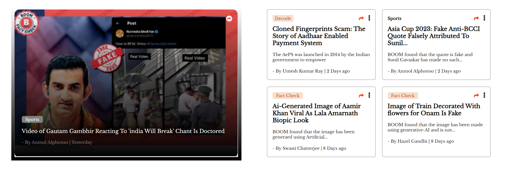

# Blog Web App



## Table of Contents

- [Introduction](#introduction)
- [Features](#features)
- [Installation](#installation)
- [Usage](#usage)
- [Technologies Used](#technologies-used)
- [Contributing](#contributing)

## Introduction

This is a simple blog web application created using HTML, CSS, and JavaScript. It allows users to view and interact with blog cards, each containing information about various news articles. Users can click on the cards to be redirected to the full articles on external websites.

## Features

- Responsive design for both mobile and desktop.
- Display of blog cards with titles, content snippets, and publication information.
- Clicking on a card redirects the user to the full article on external websites.
- Smooth hover effect with box-shadow on blog cards.

## Installation

1. Clone the repository:

   ```bash
   git clone https://github.com/your-username/blog-web-app.git
   ```

2. Open the project folder in your code editor.

## Usage

1. Open the `index.html` file in your web browser.

2. Browse through the blog cards to read news articles.

3. Click on a card to be redirected to the full article on an external website.

## Technologies Used

- HTML
- CSS
- JavaScript
- Font Awesome (for icons)

## Contributing

Contributions are welcome! If you'd like to contribute to this project, please follow these steps:

1. Fork the repository.

2. Create a new branch for your feature: `git checkout -b feature-name`.

3. Commit your changes: `git commit -m 'Add some feature'`.

4. Push to your branch: `git push origin feature-name`.

5. Submit a pull request with a description of your changes.

---

Feel free to customize the README to include additional details about your project, such as project goals, future enhancements, or any special instructions for running the code. Additionally, you can include screenshots, GIFs, or links to demo the project further.
